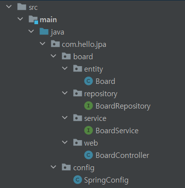

<h2>디렉터리 구조</h2>

* entity

    DTO, Entity 클래스

  <h4>entityDTO 생성 권장</h4>
  
  entity 클래스는 DB와 직접 연결되는 핵심 클래스로, 프로그램 실행 시 테이블이 생성되거나 스키마가 변경될 수 있음
  
  -> 따라서 DTO를 따로 두는 것을 권장
* reopository
    
    DAO, 데이터베이스 연결 레퍼지토리(JpaRepository)

    JpaRepository는 <u>인터페이스</u>만 있으면 자동으로 클래스와 Bean 생성

* service
  
    Service 클래스

    impl/ServiceImpl는 주로 인터페이스로 구현하여 필요한 메소드만 정의    

    요청에 대한 비지니스 로직 구현, 수행
* web

    Controller 클래스

    웹 브라우저의 요청 처리

---

* DAO(Data Access Object)
  
  DB에 접근하는 트랜잭션 객체

  비지니스 로직에 필요한 쿼리 실행

  저수준의 로직과 고급 비지니스 로직 분리와 영속성 메커니즘을 숨기기 위해 사용

  DB를 사용해 데이터 조회, 조작 기능을 전담하도록 만든 객체

* DTO(Data Transfer Object), VO(ValueObject)
  
  계층 간 데이터 교환을 위해 만든 자바 빈즈

  - DTO 
    
    로직을 갖고 있지 않은 순수한 데이터 객체 속성과 그 속성에 접근하기 위한 메소드(get, set)만 가진 클래스
  
    추가 메소드(toString, equals 등 작성 가능
  - VO
  
    불변한 객체를 만들 때 쓰는 패턴
  