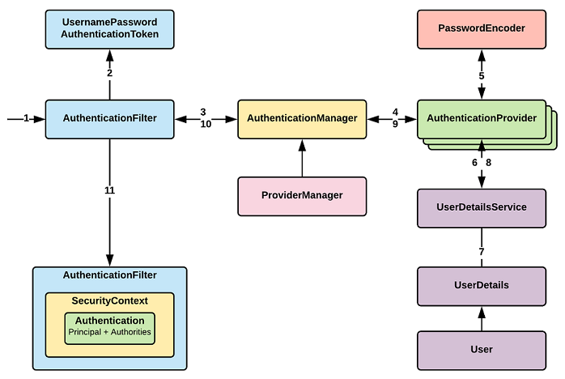

<h2>Spring Security</h2>

보안 솔루션을 제공하는 스프링 기반의 하위 프레임 워크

스프링과 분리되어 별도의 filter 기반으로 동작



1. CSRF 공격 방어
2. 모든 URL에 대한 인증 요구
3. Session Fixation 공격 방어
4. 요청 헤더 보안
5. 서블릿 API 메소드와 통합

인증 성공 후 인가 처리
* 인증(Authentication)

    - 해당 사용자가 본인이 맞는 지 확인

* 권한(Authorization, 인가)
    
    - 사용자가 특정 자원에 대한 접근 권한이 있는지 확인
  
Credential 기반 인증 방식
* Principal : 접근 주체, 보호 받는 자원에 접근하는 대상 ex) 이름, 아이디
  
* Credintail : 자원에 접근하는 대상의 비밀번호
  
----

<h3>라이브러리 추가</h3>
- build.gradle
  ```shell
  dependencies {
      ..
      #spring security
      implementation 'org.springframework.boot:spring-boot-starter-security'
      #scurity tag 사용
      implementation 'org.springframework.security:spring-security-taglibs'
      ..
  }
  ```
  
* application.properties
    ```shell
    # Security logging
    logging.level.org.springframework.security=debug
  ```
  
---
<h3>어노테이션 기반 환경설정</h3>
```java
@Configuration  //어노테이션 기반 환경설정
@EnableWebSecurity //spring security 활성화
public class SecurityConfig extends WebSecurityConfigurerAdapter {

    // 의존성 주입

    @Bean
    public PasswordEncoder passwordEncoder() {
        return new BCryptPasswordEncoder();
    }

    @Override
    public void configure(WebSecurity web) throws Exception {
        web.ignoring().antMatchers("/css/**", "/js/**", "/img/**", "/lib/**");
    }

    @Override
    protected void configure(HttpSecurity http) throws Exception {
        http.authorizeRequests()
                .antMatchers("/", "/error", "/favicon.ico",
                        "/**/*.css",
                        "/**/*.js",
                        "/**/*.png",
                        "/**/*.jpg",
                        "/login*/*").permitAll()
                .antMatchers("/member/*")
                .authenticated()
                .and()
            .formLogin()
                .loginPage("/login")
                .successHandler(customAuthenticationSuccessHandler)
                .failureHandler(customAuthenticationFailHandler)
                .and()
            .logout()
                .logoutSuccessUrl("/login")
                .logoutRequestMatcher(new AntPathRequestMatcher("/logout"))
                .invalidateHttpSession(true);
    }

    @Override
    protected void configure(AuthenticationManagerBuilder auth) throws Exception {
        auth.authenticationProvider(authenticationProvider());
    }
}
```
<h3>PasswordEncoder</h3>
비밀번호 암호화, 복호화 로직
<h3>configure 메소드</h3>
* configure(WebSecurity web)

  FilterChainProxy 생성, 다양한 Filter 설정 적용
  - web.ignoring().antMatchers(정적파일경로)

    정적 파일에 대한 시큐리티 절차 제외
* configure(HttpSecurity http)

  인터셉터로 http 요청을 안전하게 보호하는 방법 설정

  * authorizeRequests()

    요청 경로에 따라 접근 권한 설정
    - antMatchers()

      요청 경로 URL 패턴 지정
    - permitAll()

      모든 사용자에게 접근 허용
    - authenticated()

      인증된 사용자에게만 접근 허용

    - anonymous

      인증되지 않은 사용자에게만 접근 허용
    - denyAll()

      모든 사용자 접근 금지

    - hasRole()

      특정 권한을 가진 사용자만 접근
  * formLogin()

    로그인에 대한 설정
    - loginPage()

      로그인 페이지 경로
    - successHandler(커스텀 핸들러)

      로그인 성공 시 핸들러
    - failureHandler(커스텀 핸들러)

      로그인 실패 시 핸들러
  * logout()

    로그아웃에 대한 설정
    - logoutRequestMatcher(new AntPathRequestMatcher(경로))

      로그아웃 경로
    - logoutSuccessUrl()

      로그아웃 성공 시 이동할 경로
    - invalidateHttpSession()

      로그아웃 성공 시 세션 제거
  
* configure(AuthenticationManagerBuilder auth)

  사용자 인증을 위한 로직 담당
  ```java
  @Bean
  public AuthenticationProvider authenticationProvider() {
        return new CustomAuthenticationProvider();
  }
  ```
  