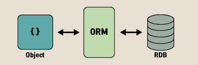

> [Inflearn] 김영한, 자바 ORM 표준 JPA 프로그래밍 -기본편
> <a href="https://www.inflearn.com/course/ORM-JPA-Basic#">https://www.inflearn.com/course/ORM-JPA-Basic#

 
<h3>ORM(Object-Relational-Mapping 객체 관계 매핑)</h3>

관계형 데이터베이스와 객체지향 환경에서의 설계된 객체를 중간에서 연결해주는 프레임워크로, 대중적인 언어 대부분에 ORM 기술 존재

---

<h2>JPA (Java Persistence API)</h2>
자바 진영의 ORM 기술 표준이자 자바 어플리케이션에서 관계형 데이터베이스를 사용하는 방식을 정의한 _인터페이스_

장점
* SQL 중심적인 개발에서 객체 중심으로 개발
* 간단한 메소드 사용으로 생산성 증가
* 편리한 유지보수
* 객체와 RDBMS간의 패러다임 불일치 해결
* 성능 향상
  - 1차 캐시와 동일성(identity) 보장
  - 트랜잭션을 지원하는 쓰기 지연(transactional write-behind) : JDBC Batch SQL 기능을 사용해 insert SQL 한번에 전송, update&delete로 인한 로우(row)락 시간 최소화
  - 지연로딩(lazy loading) : 객체가 실제로 사용될 때 해당 객체 로딩
* 데이터 접근 추상화와 벤더 독립성
* 표준

<h2>Hibernate</h2>
Jpa는 데이터베이스와 자바 객체를 매핑하기 위한 인터페이스를 제공하고 하이버네이트는 이 인터페이스를 구현하기 때문에 _Jpa의 구현체_ 라 할 수 있음

개발자가 직접 쿼리를 작성하지 않아도 하이버네이트가 지원하는 메소드 내에서 JDBC API가 동작 (개발자가 직접 jdbc api 사용하는 것은 아님)

특정 데이터베이스에 종속되지 않음으로 특정 데이터베이스에 종속되는 함수는 사용할 수 없음

그 외에 EclipseLink, DataNucleus, OpenJPA, TopLink Essentials 등

<h2>Spring Data Jpa</h2>

Jpa를 쉽게 사용하기 위해 스프링에서 제공하고 있는 프레임워크이자 Jpa를 한 단계 더 추상화시킨 인터페이스 

repository 내부적으로 entity manager를 사용하여 동작

`Spring data jpa 사용할 것을 권장`

---

[comment]: <> (<h2>영속성 컨텍스트</h2>)