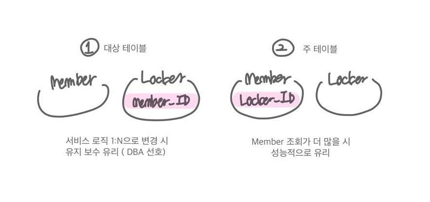

<h3>객체와 테이블 매핑</h3>

```java
@Entity(name = "entity_name") // entity mapping
@Table(name = "table_name") // db table mapping
public class Member {

    @Id // key
    @GeneratdValue(strategy = GenerationType.IDENTITY)
    private Long id; // Integer보다 Long 권유

    @Column //column
    private String memberId;
    private String memberNm;
    private String memberPw;

    ...
}
```
* 기본키
    - Id: 직접 할당
    - GeneratedValue
        - GenerateType.IDENTITY : Mysql
        - GenerateType.TABLE : 키 생성용 테이블 생성, 성능이 떨어짐
        - GenerateType.SEQUENCE : 오라클, PostgreSQL, H2 등
    
* 컬럼
    - Column
    - Temporal
        - TemporalType.DATE : 날짜
        - TemporalType.TIME : 시간
        - TemporalType.TIMESTAMP : 날짜와 시간
    - Enumerated
        - EnumType.STRING : enum 이름으로 저장
        - EnumType.ORDINAL : enum 순서 번호로 저장 (권장x)
    - Transient : DB에 반영하지 않는 속성
    
---

<h2>테이블 연관관계</h2>
테이블 사이는 조인과 외래키로 표현하나 객체는 참조로 표현

테이블은 외래 키 하나로 두 테이블의 연관관계를 맺을 수 있으나
객체는 단방향 연결 두 번(두 번의 참조)을 통해 양방향 연관관계를 맺음

<u><b>연관관계의 주인은 외래키가 있는 곳(참조하는 곳)</b></u>
- 주인
    - 참조하는 곳(외래 키가 있는 곳)
    - 읽고 쓰기 가능 
    - @JoinColumn(name="참조하는 컬럼명")
- 주인 반대편
    - 참조되는 곳
    - 읽기만 가능
    - @OneToMany(mappedBy= "주인객체에서 매핑대상")

<h3>1. 일대일(OneToOne)</h3>
- 그 반대도 일대일 관계
- 외래 키에 데이터베이스 유니크(UNI) 제약조건 추가
- 주 테이블이나 대상 테이블 중 외래키 선택 가능 (외래키가 있는 곳이 관계의 주인)
  
  1. 대상 테이블에 외래 키가 있는 경우 
        
     주 테이블만 조회해도 대상 테이블에 데이터가 있는 지 확인 가능

     값이 없으면 외래 키에 null 허용
     
  2. 주 테이블에 외래 키가 있는 경우

     일대다 관계로 변경할 때 테이블 구조 유지
    
     프록시 기능의 한계로 지연 로딩으로 설정해도 항상 즉시 로딩
    
- 주 테이블(주인)
    ```java
    @Entity
    public class Member {
    
        @Id
        @GeneratedValue
        private Long memberId;
    
        @Column
        private String memberName;
        private int memberAge;
    
        @OneToOne
        @JoinColum(name = "lockerId") //참조하는 컬럼명 
        private Locker locker;
    }
  ```
- 대상 테이블
    ```java
    @Entity
    public class Locker {

        @Id @GeneratedValue
        private Long lockerId;
        
        //member객체에서 locker와 매핑
        @OneToOne(mappedBy = "locker") 
        private Member member;
    }
    ```
  
<h3>2. 일대다(OneToMany)</h3>
* 일(1) 쪽이 연관관계 주인
* @JoinColum을 꼭 사용해야 함
* 엔티티가 관리하는 외래 키가 다른 테이블에 있어 연관관계 관리를 위해 추가 update 쿼리를 실행해야함
* 일대다 지양, 다대일 양방향 매핑 사용할 것
* 주인
    ```java
    @Entity
    public class Team {

        @Id
        @GeneratedValue
        private Long teamId;
    
        @Column
        private String teamName;
    
        @OneToMany
        @JoinColumn(name = "teamId") //참조하는 컬럼명
        List<Member> members = new ArrayList<Member>();
        }
  ```
* 반대편
    ```java
    @Entity
    public class Member {
    
        @Id
        @GeneratedValue
        private Long memberId;
    
        @Column
        private String memberName;
        private int memberAge;
    }
  ```

<h3>3. 다대일(ManyToOne)</h3>
* 가장 많이 사용하는 연관관계
* 반대 관계는 일대다(OneToMany)
* `외래 키가 있는 쪽이 연관관계의 주인`
* 양쪽을 서로 참조하도록 개발(양방향 매핑)
* 연관관계의 주인 테이블
    ```java
    @Entity
    public class Member {
    
        @Id
        @GeneratedValue
        private Long memberId;
    
        @Column
        private String memberName;
        private int memberAge;
    
        //참조하는 컬럼명
        @ManyToOne
        @JoinColum(name = "teamId")
        private Team team;
    }
    ```
  `양방향 매핑 시 연관관계의 주인에 값 입력해야 함`
* 주인이 아닌 테이블
    ```java
    @Entity
    public class Team{

        @Id
        @GeneratedValue
        private Long teamId;
    
        @Column
        private String teamName;
    
        //주인 테이블에서 매핑되는 이름
        @OneToMany(mappedBy = "team")
        List<Member> members = new ArrayList<Member>();
    }
    ```

<h3>4. 다대다(ManyToMany)</h3>
* 실무에서 사용하지 않음
