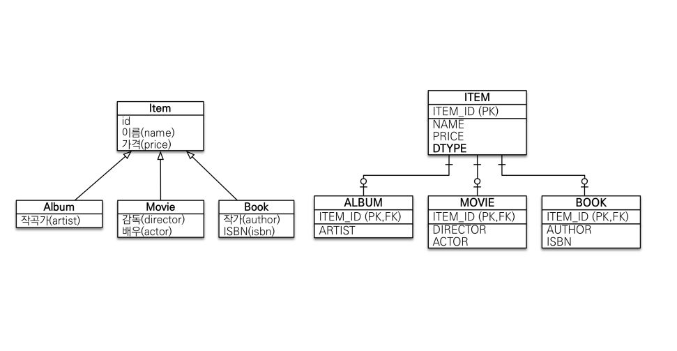
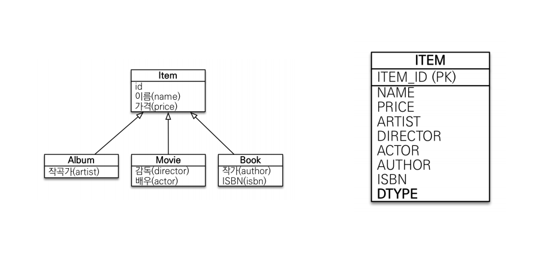
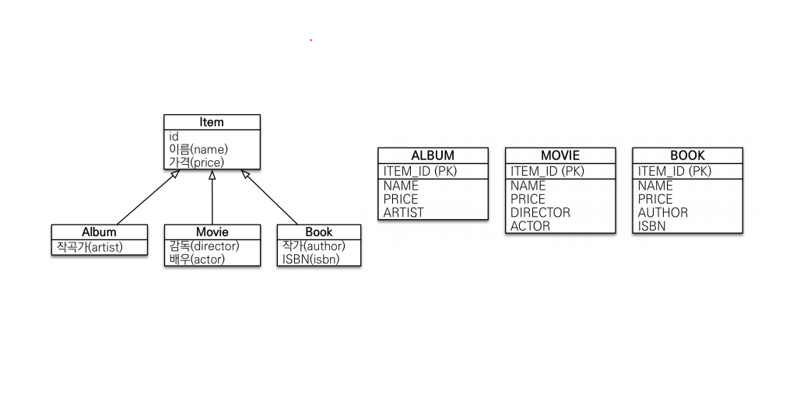

<h2>상속관계 매핑</h2>
<h3>1. 조인전략</h3>
   
   각각 테이블로 전환하여 슈퍼타입의 ID를 PK, FK로 연결
   
   장점
   - 테이블 정규화
   - 외래 키참조 무결성 제약조건 활용 가능
   - 저장공간 효율화
    
단점
- 조회 시 조인 연산이 많아 쿼리가 복잡하고 성능 저하

```java
@Inheritance(strategy=InheritanceType.JOINED)
```

<h3>2. 단일 테이블 전략</h3>


   하나의 테이블로 구현하여 슈퍼, 서브타입의 속성 모두 컬럼으로 지님
   
장점
  - 조인이 필요없어 쿼리 단순
  - 일반적으로 조회 성능이 빠름

단점
  - 자식 엔티티가 매핑한 컬럼 모두 null허용
  - 테이블이 커질 경우 오히려 조회 성능 저하
   
```java
@Inheritance(strategy=InheritanceType.SINGLE_TABLE)
```

<h3>3. 구현 클래스마다 테이블 전략</h3>

   
   서브타입마다 테이블로 구현하여 슈퍼타입의 속성 모두 포함

   각각의 테이블을 하나로 묶을 수 없어 사용 지양
   
```java
@Inheritance(strategy=InheritanceType.TABLE_PER_CLASS)
```

<h3>4. Discriminator</h3>

   두 테이블 join해서 사용
   ```java
   // 슈퍼타입 엔티티
@DiscriminaterColumn(name = "DTYPE")

// 서브타입 엔티티
@DiscriminatorValue("entity_name") //default=entity_name
   ```
   
---

<h3>MappedSuperclass</h3>

상속이 아닌 공통 매핑 정보가 필요할 때 사용

슈퍼 클래스는 추상 클래스로 권장

주로 전체 엔티티에 대해 공통으로 지닌 속성에 대해 정의

`서브타입에 속성 정보만 제공함으로 슈퍼타입으로 조회, 검색 불가`

* 슈퍼 클래스
   ```java
    @Getter
    @Setter
    @MappedSuperclass
    public abstract class BaseEntity {
    
        private String createdBy;
        private LocalDateTime createdDate;
        
        private String lastModifiedBy;
        private LocalDateTime lastModifiedDate;
    }
  ```
  
* 서브 클래스
    ```java
    @Entity
    public class Member extends BaseEntity {
        ...
    }
   ```
  
쿼리 실행 시 Member 테이블에 BaseEntity의 컬럼들 생성


