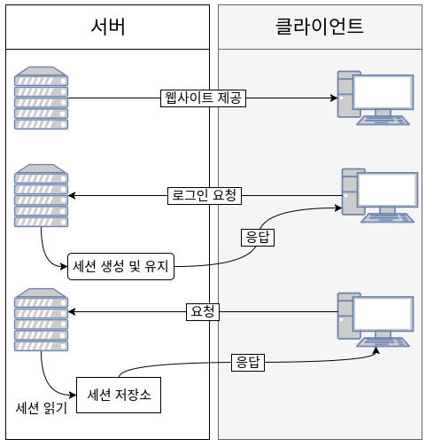
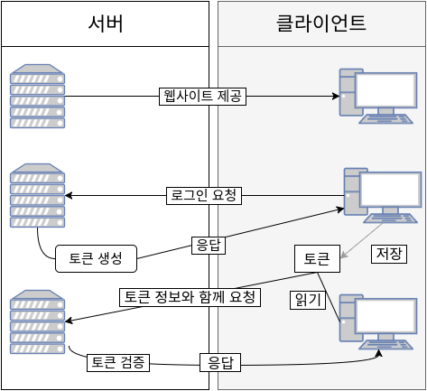
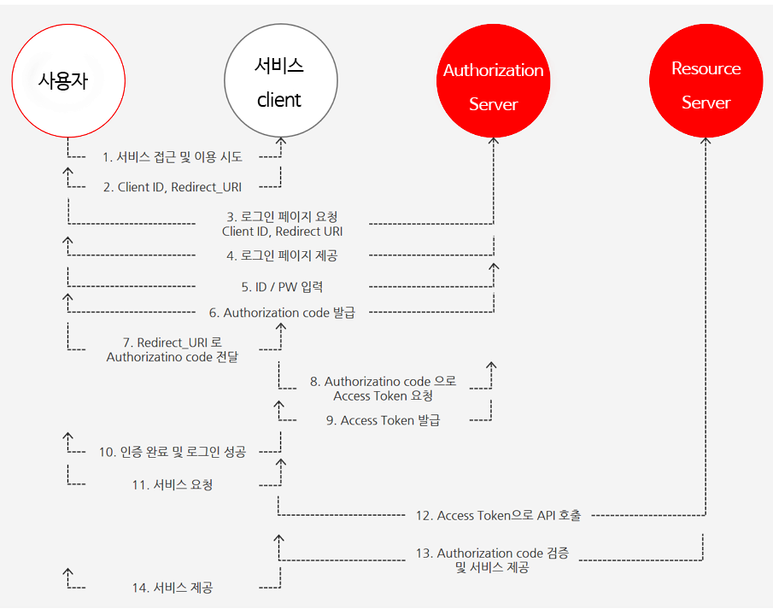

<h3>Stateful</h3>

  서버와 클라이언트 간의 상태 유지

  서버의 현재 상태(클라이언트와의 상태 유지)에 따라 클라이언트의 요청에 대한 응답이 달라짐

  네트워크가 안정적인 경우 stateful 서버를 사용하는 것이 유리

  * Cookie
  
    클라이언트(브라우저) 로컬에 저장되는 키, 값의 데이터파일로 서버의 자원을 이용하지 않음
    
    사용자가 따로 요청하지 않아도 브라우자가 요청 시 요청 헤더에 넣어 자동으로 서버에 전송
    
    브라우저가 닫혀도 유지
  
    서버 요청 시 속도가 빠름
    
    예) 아이디와 비밀번호 저장, 쇼핑몰 장바구니 등
  * Session
        
    서버 측에서 관리하며 서버 자원 사용
    
    세션 ID를 부여하여 웹 브라우저가 서버에 접속해 종료할 때 까지 인증상태 유지
    
    사용자가 많아질 수록 서버 메모리를 많이 차지하여 성능저하를 일으킬 수 있음
  
    보안 면에서 쿠키보다 유리하나 속도는 느림
    
    예) 로그인

<h3>Stateless</h3>

  서버와 클라이언트 간의 상태 유지하지 않음

  클라이언트의 상태를 서버나 세션에 유지하지 않고 클라이언트로부터 새로 도착한 요청에만 의존하여 서비스 제공

---

<h3>서버기반 인증 시스템</h3>
* 서버기반 인증이란?
    
    서버 측에서 사용자의 정보 기억하며 이를 위해 세션을 계속 유지해야함

    Stateful 서버

    
  
    * 문제점
      
      - 사용자 증가 시 서버에 저장된 세션 증가로 서버 램 과부화
      - 증가된 트래픽을 처리하기 위해 서버를 확장하고 세션을 분산시키는 시스템을 설계해야하지만 해당 과정이 어렵고 복잡함
      - CORS(Cross-Origin Resource Sharing) 
    
        쿠키는 단일 도메인 및 서브 도메인에서만 작동하도록 설계되어있어 여러 도메인에서 관리하는 것이 번거러움

<h3>토큰기반 인증 시스템</h3>

* 토큰기반 인증이란?
    
  인증받은 사용자들에게 토큰을 발급하고 서버에 요청 시마다 요청헤더에 토큰을 함께 보내도록 하여 서버에서 토큰 유효성을 검사

  Stateless 서버

  

  * 장점
      
    - Stateless로 서버 확장에 매우 적합
    
    - 쿠키 사용에 의한 취약점 사라짐 (토큰 환경의 취약점 주의해야함)
  
    - 토큰에 선택적인 권한만 부여하여 발급 가능, OAuth의 경우 소셜 계정을 이용하여 다른 웹서비스에서도 로그인 가능
  
    - 어떤 도메인이나 디바이스에서도 토큰만 유효하다면 요청이 정상적으로 처리됨으로 CORS 해결
  

---

<h3>OAuth</h3>

[참고] <a href='https://developers.payco.com/guide/development/start'>페이코의 OAuth2.0 프로세스</a>

* OAuth란?
  
  사용자가 페이스북이나 구글, 네이버 등 소셜 계정을 사용하여 로그인 했을 때
  접근 권한을 인증하는 개방형 표준 프로토콜
  
  예) 인터넷 포털에서 별도의 회원가입 절차 없이 소셜 계정으로 로그인, 회원가입 할 때
  
* OAuth 2.0

